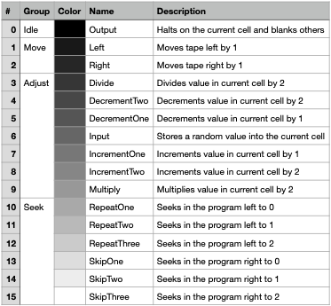

# Laminoid Tape
Laminoid Tape is a complete toolchain for original and modified Brainfuck development.
Included is a compiler that compiles programs to bytecode, a runtime that can run from source- or bytecode
and a decompiler to turn bytecode back to commented source code.

It was initially developed for our tape machine interactive business cards to help us write, debug and compile programs,
but it can be used in own projects too, as long as a compatible runtime is provided.

The toolchain supports all major platforms including macOS, Linux and Windows.

## Instruction set
All opcodes are four bits wide and two opcodes are packed into one byte. The low nibble precedes the high one.
If a program has an odd number of opcodes, the last one can be padded with the halt opcode.
The packing used results in 50% to 75% space savings compared to regular ASCII Brainfuck, if not more, as comments are removed.

The below opcodes are available:



The color field indicates the LED brightness used when displaying the instruction on our business card.

## Enhanced Brainfuck
The enhanced version of Brainfuck available with Tape adds three levels of unmatched jumps through the three sets of parantheses `[]{}()`.
It is possible to skip over other parentheses to enable much more powerful program flow control.
To facilitate more complex algorithms in less code-space (since there is not much on the card), bit-shifts via multiply `*` and divide `/` are also available.
Punctuation or symbols not defined as instructions are (unlike in original mode) not allowed and are treated as syntax errors. 

## Original Brainfuck
Original Brainfuck support is provided and almost all operations are as defined in the standard implementation, except:
- By default, only five cells are available (use `-memory 30000` to be fully compatible)
- There is no support for standard input or output from the program, but rather *in* `,` reads a random number and *out* `.` halts the program
- Nesting `[]` is only permitted up to three levels deep

## Instructions
- `.` stop the program
- `<` move left on the tape
- `>` move right on the tape
- `/` divide by 2 (only enhanced)
- `-` decrement cell value
- `,` input random value into cell
- `+` increment cell value
- `*` multiply by 2 (only enhanced)
- `[` skip until 1 (enhanced) or go to matching repeat (original)
- `(` skip until 2 (only enhanced)
- `{` skip until 3 (only enhanced)
- `]` repeat until 1 (enhanced) or go to matching skip (original)
- `)` repeat until 2 (only enhanced)
- `}` repeat until 3 (only enhanced)

## Usage
The toolchain follows a simple `input -> processing -> output` pipeline model.

### Input
The input stage controls how instructions are encoded and where they come from.
If compilation is requested, the input is treated as source-code and compiled to opcodes, otherwise bytecode is read directly.
The original-flag controls, whether the source code is original Brainfuck syntax instead of the enhanced syntax provided by Tape.
If an input file path is set, it is used instead of standard in. Tape can be used in pipes.

```
  -input string
        the input file name instead of stdin
  -compile
        input source code over bytecode
  -original
        whether to use original brainfuck syntax
```

### Processing
In this stage, you can optionally run the opcodes obtained in the input stage.
The size of the tape can be set via memory, as well as an optional seed if you want predictable input values.
If you enable step mode, you will be provided a step-by-step output of your program running.
```
  -run
        whether to run the program
  -memory int
        the size of the tape in bytes (default 5)
  -seed int
        predictable random number seed over randomness
  -step
        whether to log after every step
```

### Output
Finally, you can choose to output the bytecode from the earlier stages.
Unless you run while not decompiling, output is always produced in bytecode form.
If you want a decompiled output with every opcode explained, choose decompile.
As with input, a file name can be specified to write the output to instead of standard out.
```
  -output string
        the output file name instead of stdout
  -decompile
        output source code over bytecode
```

## Examples
### Compile program
`./tape -input add.bf -compile -original -output add.tx`

### Run program from source file
`./tape -input add.bf -compile -original -run -step`

### Run program from bytecode
`./tape -input add.tx -run`

### Run program from command-line
`echo "+++[-]" | ./tape -compile -run -step`

### Decompile bytecode program to standard out
`./tape -input add.tx -decompile`

Have fun!
